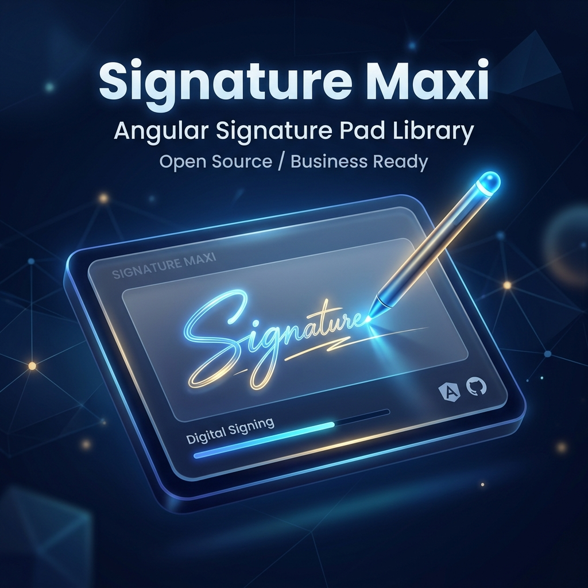

  

  <h1>Signature Maxi</h1>
  
<strong>A Premium, Business-Ready Angular Signature Capture Library</strong>

---

## 🚀 Overview

**Signature Maxi** is a production-grade, enterprise-ready electronic signature solution built natively for Angular. It offers an elegant, floating glassmorphism dashboard and a seamless, high-performance signature capture experience across Desktop, iOS, and Android devices.

Whether you need to collect mandatory signatures for legal documents, or allow optional sign-offs from an entire team, Signature Maxi handles the heavy lifting with its dynamic, reactive configuration state.

## ✨ Key Features

- **3 Signature Modes**:
  - 🖋️ **Draw**: Smooth, high-DPI canvas drawing using `signature_pad`.
  - ⌨️ **Type**: Generate beautiful, stylized script signatures automatically based on the user's name.
  - 📸 **Upload & Camera**: Allow users to upload existing signatures or capture them live using their device camera (Full cross-platform support for Windows, Android, and iOS).
- **Advanced Watermarking**: Automatically stamp signatures with fully configurable metadata (Timestamp, Content ID, Name, Role) including customizable opacity, rotation, and color.
- **Content ID Segregation**: Effortlessly reuse the component across multiple documents or contracts without cross-contaminating signatures.
- **Enterprise UI Design**: Ships with a premium, business-ready aesthetic featuring custom SVGs, pill badges, and micro-animations out-of-the-box.
- **Sync & State**: Highly reactive `BehaviorSubject` based state management ensures that UI updates are strictly synchronous without dropping out of Angular's Zone.

## 📦 Installation

Currently, Signature Maxi is managed as an integrated standalone workspace.

To build and run the project locally, please refer to the [Developer Guide](dev.md).

## 🛠️ Tech Stack

- **Framework**: Angular 21
- **Styling**: Vanilla CSS/SCSS (No Tailwind required)
- **Signature Engine**: `signature_pad`
- **Deployment**: Configured for continuous deployment via GitHub Actions to GitHub Pages.

## 📄 License

This project is open-source and available under the [MIT License](LICENSE).
